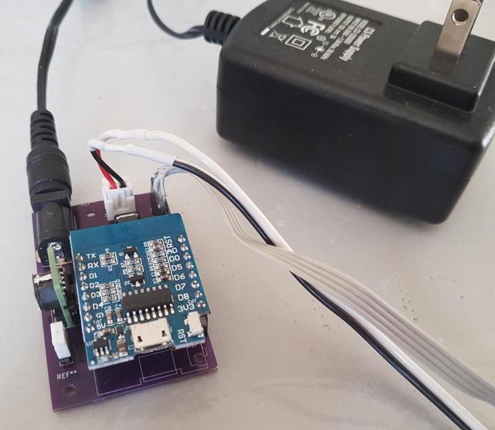

# wemos_d1_carrier_with_power
Wemos D1 Mini carrier board with power DC volt output and I2C interface

This is a simple board takes input up to ~30 VDC and powers a [Wemos D1 Mini](https://universal-solder.ca/product/wemos-d1-mini-esp8266-wifi-iot-module/).
The Wemos D1 controls a MOSFET which switches the input voltage, and has I2C broken out to a 4 pin header. 

Useful for anything which senses the environment and controls something that requires more power of voltage than the D1's ESP8266 can provide. I used it to control a dough proofing oven.

A dough proofing oven controller. Temperature and humidity sensed using an AOSONG AHT25. The MOSFET controls some silicon heating pads.

